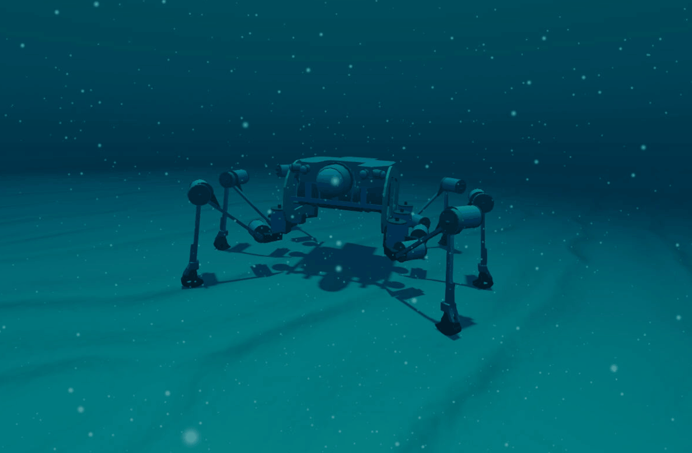

---
# Silver2 Stonefish Simulation
Welcome to the Silver2 hexapod underwater simulation! This guide provides step-by-step instructions for launching the Stonefish-ROS 2 simulation and controlling the robot's movements using your keyboard.

The setup involves three main components:
1. **Stonefish:** The core C++ underwater physics simulator.
2. **Stonefish ROS 2:** The ROS 2 wrapper that connects Stonefish to the ROS 2 ecosystem.
3. **Stonefish Silver:** The custom ROS 2 package containing the robot-specific configurations, models, and control nodes.

### 1. Prerequisites
Before you begin, ensure your system has the following dependencies enabled.
- [ROS 2 Jazzy Desktop](https://docs.ros.org/en/jazzy/Installation.html)
- [Stonefish Simulator v1.5](https://anvilproject.org/guides/content/creating-links)
- A configured Python virtual environment (```venv```) with all required libraries. A requirements file is [included](./requirements.txt) in the repository.

### 2. Launch the Stonefish Simulation
Now, we will set up the ROS 2 workspace that contains the simulator's ROS wrapper and our custom robot package.
```
# Navigate to your cloned repository
cd ~/PathToWorkspace/silver2_stonefish

# Source the ROS 2 environment and the workspace
source /opt/ros/jazzy/setup.bash
source install/setup.bash

# Activate your Python virtual environment
source venv/bin/activate

# Launch the simulation
ros2 launch stonefish_silver silver_simulation.launch.py
```
Leave this terminal and the simulation running. It is now hosting the Stonefish simulation underwater world.

### 3. Control the robot with your keyboard
To actually drive the robot, you need to run a second program that translates your keystrokes into velocity commands.
1. **Open a second, separate terminal.**
2. **Run the Setup Commands for the Controller:** Just like before, you need to set up the environment in this new terminal. Copy and paste the entire block below.

    ```
    # Source the ROS 2 environment
    source /opt/ros/jazzy/setup.bash

    # Run the keyboard teleop node
    ros2 run teleop_twist_keyboard teleop_twist_keyboard
    ```
3. **Drive the Robot:** The terminal will now display instructions for controlling the robot. Make sure this second terminal window is active (clicked on) and use the keys (e.g., ```i```, ```j```, ```k```, ```l```) to move the robot around in the simulation.

You have now successfully launched and are controlling the Silver2 hexapod!

### Functionality Demonstration
